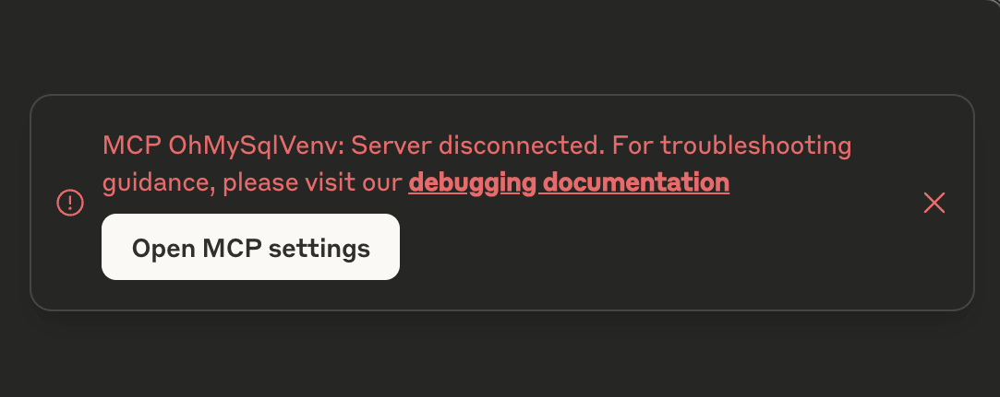

Quick Start
==============================================================================
Welcome to ``mcp_ohmy_sql``! This guide will get you up and running with the SQL Model Context Protocol (MCP) server in just a few minutes.

What You'll Achieve
------------------------------------------------------------------------------
By the end of this guide, you'll have a fully functional SQL MCP server that enables you to:

**Database Discovery**

- List available databases and their schemas
- Explore table structures and relationships
- Understand data models through AI-generated insights

**Natural Language Querying**

- Ask business questions in plain English
- Get SQL queries generated automatically
- Receive formatted results with explanations

**Data Analysis & Visualization**

- Generate business reports and insights
- Create visualizations and charts
- Build entity relationship diagrams

Prerequisites
------------------------------------------------------------------------------
Before we begin, make sure you have:

- `Claude Desktop <https://claude.ai/download>`_ installed (our AI client for this tutorial)
- Basic familiarity with JSON configuration files
- Access to download a sample database file

.. note::

    While this guide uses Claude Desktop, ``mcp_ohmy_sql`` works with any MCP-compatible AI client.

Step 1: Configure Claude Desktop
------------------------------------------------------------------------------
First, we need to tell Claude Desktop about our MCP server. Following the official `Claude Desktop Manual <https://modelcontextprotocol.io/quickstart/user>`_, locate your ``claude_desktop_config.json`` file:

**Configuration File Locations:**

- **macOS**: ``~/Library/Application Support/Claude/claude_desktop_config.json``
- **Windows**: ``%APPDATA%\Claude\claude_desktop_config.json``

Open the file and add the following configuration to the ``mcpServers`` section:

.. code-block:: json

    {
        "mcpServers": {
            "OhMySql": {
                "command": "uvx",
                "args": [
                    "--with",
                    "mcp-ohmy-sql[sqlite,postgres]",
                    "mcp-ohmy-sql"
                ],
                "env": {
                    "MCP_OHMY_SQL_CONFIG": "/path/to/mcp_ohmy_sql.json"
                }
            }
        }
    }

.. tip::

    **Database-Specific Dependencies**
   
    The ``[sqlite,postgres]`` part specifies which database drivers to install. Choose the ones you need:
   
    - ``sqlite`` - For SQLite databases
    - ``postgres`` - For PostgreSQL databases
    - ``mysql`` - For MySQL/MariaDB databases
    - ``mssql`` - For Microsoft SQL Server
    - ``oracle`` - For Oracle databases
   
    Example: For MySQL and PostgreSQL, use ``mcp-ohmy-sql[mysql,postgres]``

.. tip::

    To use specific version of ``mcp_ohmy_sql``, you can specify the claude_desktop_config.json::

    .. code-block:: python

        "args": [
            "--with",
            "mcp-ohmy-sql[sqlite,postgres]==0.1.2",
            "mcp-ohmy-sql"
        ],

.. important::

    Remember to update the ``MCP_OHMY_SQL_CONFIG`` path to point to where you'll create your configuration file in the next step.

Step 2: Set Up Sample Database & Configuration
------------------------------------------------------------------------------
Now we'll create a database configuration file and download a sample database to get you started quickly.

**2.1 Download Sample Database**

We'll use the Chinook database, a popular sample database that contains data about a digital music store:

1. Download the `Chinook_Sqlite.sqlite <https://github.com/lerocha/chinook-database/releases/download/v1.4.5/Chinook_Sqlite.sqlite>`_ file
2. Save it to a convenient location (e.g., your home directory or Documents folder)
3. Note the full path to this file—you'll need it for the configuration

.. tip::

    **About the Chinook Database**
   
    Chinook contains realistic data about:

    - Artists, albums, and tracks
    - Customers and employees
    - Invoices and sales data
    - Music genres and media types
   
    It's perfect for learning SQL and demonstrating database analytics!

**2.2 Create Configuration File**

Create a new file named :ref:`mcp_ohmy_sql.json <configuration-guide>` with the following content:

.. code-block:: json

    {
        "version": "0.1.1",
        "settings": {},
        "databases": [
            {
                "identifier": "chinook_sqlite",
                "description": "Chinook music store sample database - contains artists, albums, tracks, customers, and sales data",
                "connection": {
                    "type": "sqlalchemy",
                    "create_engine_kwargs": {
                        "url": "sqlite:////path/to/Chinook_Sqlite.sqlite"
                    }
                },
                "schemas": [
                    {
                        "name": null,
                        "table_filter": {
                            "include": [],
                            "exclude": [
                                "Playlist",
                                "PlaylistTrack"
                            ]
                        }
                    }
                ]
            }
        ]
    }

.. seealso::

    See :ref:`configuration-guide` for a complete reference on the configuration options available in :ref:`mcp_ohmy_sql.json <configuration-guide>`.

**2.3 Update Configuration Paths**

.. important::

    **Critical Configuration Updates**
   
    1. **Database Path**: Replace ``/path/to/Chinook_Sqlite.sqlite`` with the actual absolute path to your downloaded database file
    2. **Environment Variable**: Update the ``MCP_OHMY_SQL_CONFIG`` path in ``claude_desktop_config.json`` to point to your :ref:`mcp_ohmy_sql.json <configuration-guide>` file
   
    **Example paths:**
   
    - macOS/Linux: ``sqlite:////Users/username/Downloads/Chinook_Sqlite.sqlite``
    - Windows: ``sqlite:///C:\\Users\\username\\Downloads\\Chinook_Sqlite.sqlite``

.. note::

    **Configuration Explanation**
   
    - **Table Filtering**: We exclude ``Playlist`` and ``PlaylistTrack`` tables to keep the initial exploration focused on core music store data
    - **Schema Name**: ``null`` means we're using the default SQLite schema
    - **Identifier**: ``chinook_sqlite`` is how we'll reference this database in queries

Step 3: Launch Claude Desktop
------------------------------------------------------------------------------
With your configuration complete, it's time to start Claude Desktop and connect to your database.

1. **Restart Claude Desktop** completely (quit and relaunch) to load the new MCP configuration
2. **Start a new conversation** - you should see the MCP tools become available
3. **Verify connection** by checking the tools panel - you should see available database tools

.. tip::

    **Success Indicators**
   
    Look for these signs that everything is working:
   
    - Tools panel shows database-related functions
    - No error messages in Claude Desktop
    - You can start asking database questions immediately

Troubleshooting
------------------------------------------------------------------------------
If you encounter issues, here are the most common problems and solutions:

**Problem: "uvx command not found"**

This means the ``uvx`` package manager isn't installed or available in your system PATH.

.. code-block:: bash

    # Install uvx
    pip install uv

    # Test installation
    uvx --version

If the global installation doesn't work, you can specify the absolute path in your Claude configuration:

.. code-block:: json

    {
        "command": "/path/to/uvx",
        "args": ["--with", "mcp-ohmy-sql[sqlite]", "mcp-ohmy-sql"]
    }

**Problem: "Claude Desktop cannot connect to the MCP server"**

First, ensure you have the latest version of `uv <https://github.com/astral-sh/uv>`_ installed. If you encounter error messages related to ``claude_desktop_config.json``, this typically indicates that the uv command is not properly recognizing your MCP server configuration.

Otherwise, this is usually a configuration issue. Check these items:

1. **Verify JSON syntax** - Ensure your :ref:`mcp_ohmy_sql.json <configuration-guide>` file is valid JSON
2. **Check file paths** - Confirm all paths are absolute and accessible
3. **Test database connection** independently:

.. code-block:: python

    import sqlalchemy as sa

    # Test your exact connection string
    engine = sa.create_engine("sqlite:////your/path/to/Chinook_Sqlite.sqlite")
    with engine.connect() as conn:
       result = conn.execute(sa.text("SELECT 1"))
       print("Database connection successful:", result.fetchone())

**Problem: "No tools available" or missing database functions**

- Restart Claude Desktop completely (not just refresh)
- Check the Claude Desktop logs for detailed error messages
- Verify the ``MCP_OHMY_SQL_CONFIG`` environment variable path is correct

Exploring Your Database with AI
------------------------------------------------------------------------------
Now comes the exciting part! Let's explore what you can do with your connected database. The following examples show real interactions with the Chinook database using natural language.

**What You Can Do:**

**Database Discovery**

- List available databases and schemas
- Explore table structures and relationships
- Understand your data model

**Business Intelligence**

- Ask complex business questions in plain English
- Get automatically generated SQL queries
- Receive formatted results with insights

**Data Visualization**

- Create charts and reports
- Generate entity relationship diagrams
- Export results for presentations

**Example 1: Discover Your Data**
~~~~~~~~~~~~~~~~~~~~~~~~~~~~~~~~~~~~~~~~~~~~~~~~~~~~~~~~~~~~~~~~~~~~~~~~~~~~~~
Start by asking AI what's available in your database:

    *"Tell me about all databases I have"*

.. image:: ./11-List-Databases.png
    :alt: Claude listing available databases with descriptions

As you can see, AI uses the ``list_databases`` tool to show your configured databases. In this case, we have both SQLite and PostgreSQL versions of the Chinook database available.

**Example 2: Understand Your Schema**
~~~~~~~~~~~~~~~~~~~~~~~~~~~~~~~~~~~~~~~~~~~~~~~~~~~~~~~~~~~~~~~~~~~~~~~~~~~~~~
Next, explore the structure of your database:

    *"Show me the schema details of the chinook database"*

.. image:: ./12-Get-Database-Schema-Details.png
    :alt: Claude displaying detailed database schema information

AI retrieves the complete schema structure, showing tables, columns, data types, and relationships. This gives you a comprehensive understanding of your data model.

.. dropdown:: Sample Database Schema Details

    .. code-block:: typescript

        Database chinook sqlite(
          Schema default(
            Table Album(
              AlbumId:INT*PK*NN,
              Title:STR*NN,
              ArtistId:INT*NN*FK->Artist.ArtistId,
            )
            Table Artist(
              ArtistId:INT*PK*NN,
              Name:STR,
            )
            Table Customer(
              CustomerId:INT*PK*NN,
              FirstName:STR*NN,
              LastName:STR*NN,
              Company:STR,
              Address:STR,
              City:STR,
              State:STR,
              Country:STR,
              PostalCode:STR,
              Phone:STR,
              Fax:STR,
              Email:STR*NN,
              SupportRepId:INT*FK->Employee.EmployeeId,
            )
            Table Employee(
              EmployeeId:INT*PK*NN,
              LastName:STR*NN,
              FirstName:STR*NN,
              Title:STR,
              ReportsTo:INT*FK->Employee.EmployeeId,
              BirthDate:DT,
              HireDate:DT,
              Address:STR,
              City:STR,
              State:STR,
              Country:STR,
              PostalCode:STR,
              Phone:STR,
              Fax:STR,
              Email:STR,
            )
            Table Genre(
              GenreId:INT*PK*NN,
              Name:STR,
            )
            Table Invoice(
              InvoiceId:INT*PK*NN,
              CustomerId:INT*NN*FK->Customer.CustomerId,
              InvoiceDate:DT*NN,
              BillingAddress:STR,
              BillingCity:STR,
              BillingState:STR,
              BillingCountry:STR,
              BillingPostalCode:STR,
              Total:DEC*NN,
            )
            Table InvoiceLine(
              InvoiceLineId:INT*PK*NN,
              InvoiceId:INT*NN*FK->Invoice.InvoiceId,
              TrackId:INT*NN*FK->Track.TrackId,
              UnitPrice:DEC*NN,
              Quantity:INT*NN,
            )
            Table Track(
              TrackId:INT*PK*NN,
              Name:STR*NN,
              AlbumId:INT*FK->Album.AlbumId,
              MediaTypeId:INT*NN*FK->MediaType.MediaTypeId,
              GenreId:INT*FK->Genre.GenreId,
              Composer:STR,
              Milliseconds:INT*NN,
              Bytes:INT,
              UnitPrice:DEC*NN,
            )
            Table MediaType(
              MediaTypeId:INT*PK*NN,
              Name:STR,
            )
            View AlbumSalesStats(
              AlbumId:INT,
              AlbumTitle:STR,
              ArtistName:STR,
              TotalSales:INT,
              TotalQuantity:INT,
              TotalRevenue:DEC,
              AvgTrackPrice:DEC,
              TracksInAlbum:INT,
            )
          )
        )
        Database chinook postgres(
          Schema default(
            Table Employee(
              EmployeeId:INT*PK*NN,
              LastName:STR*NN,
              FirstName:STR*NN,
              Title:STR,
              ReportsTo:INT*FK->Employee.EmployeeId,
              BirthDate:TS,
              HireDate:TS,
              Address:STR,
              City:STR,
              State:STR,
              Country:STR,
              PostalCode:STR,
              Phone:STR,
              Fax:STR,
              Email:STR,
            )
            Table Artist(
              ArtistId:INT*PK*NN,
              Name:STR,
            )
            Table Album(
              AlbumId:INT*PK*NN,
              Title:STR*NN,
              ArtistId:INT*NN*FK->Artist.ArtistId,
            )
            Table Customer(
              CustomerId:INT*PK*NN,
              FirstName:STR*NN,
              LastName:STR*NN,
              Company:STR,
              Address:STR,
              City:STR,
              State:STR,
              Country:STR,
              PostalCode:STR,
              Phone:STR,
              Fax:STR,
              Email:STR*NN,
              SupportRepId:INT*FK->Employee.EmployeeId,
            )
            Table Track(
              TrackId:INT*PK*NN,
              Name:STR*NN,
              AlbumId:INT*FK->Album.AlbumId,
              MediaTypeId:INT*NN*FK->MediaType.MediaTypeId,
              GenreId:INT*FK->Genre.GenreId,
              Composer:STR,
              Milliseconds:INT*NN,
              Bytes:INT,
              UnitPrice:DEC*NN,
            )
            Table Genre(
              GenreId:INT*PK*NN,
              Name:STR,
            )
            Table MediaType(
              MediaTypeId:INT*PK*NN,
              Name:STR,
            )
            Table Invoice(
              InvoiceId:INT*PK*NN,
              CustomerId:INT*NN*FK->Customer.CustomerId,
              InvoiceDate:TS*NN,
              BillingAddress:STR,
              BillingCity:STR,
              BillingState:STR,
              BillingCountry:STR,
              BillingPostalCode:STR,
              Total:DEC*NN,
            )
            Table InvoiceLine(
              InvoiceLineId:INT*PK*NN,
              InvoiceId:INT*NN*FK->Invoice.InvoiceId,
              TrackId:INT*NN*FK->Track.TrackId,
              UnitPrice:DEC*NN,
              Quantity:INT*NN,
            )
            View AlbumSalesStats(
              AlbumId:INT,
              AlbumTitle:STR,
              ArtistName:STR,
              TotalSales:INT,
              TotalQuantity:INT,
              TotalRevenue:DEC,
              AvgTrackPrice:DEC,
              TracksInAlbum:INT,
            )
          )
        )

**Example 3: Ask Business Questions**
~~~~~~~~~~~~~~~~~~~~~~~~~~~~~~~~~~~~~~~~~~~~~~~~~~~~~~~~~~~~~~~~~~~~~~~~~~~~~~
This is where the magic happens—ask real business questions in natural language:

    *"Find me the top 3 sales albums"*

.. image:: ./13-Ask-Business-Question.png
    :alt: Claude executing a complex business query and showing results

.. dropdown:: AI writen SQL query

    .. code-block:: sql

        SELECT
            AlbumTitle,
            ArtistName,
            TotalRevenue,
            TotalQuantity,
            TracksInAlbum
        FROM AlbumSalesStats
        ORDER BY TotalRevenue DESC
        LIMIT 3

.. dropdown:: Encoded Query Result

    .. code-block:: markdown

        # Execution Time
        0.014 seconds

        # Query Result
        | AlbumTitle                               | ArtistName                     |   TotalRevenue |   TotalQuantity |   TracksInAlbum |
        |:-----------------------------------------|:-------------------------------|---------------:|----------------:|----------------:|
        | Battlestar Galactica (Classic), Season 1 | Battlestar Galactica (Classic) |        35.8200 |              18 |              24 |
        | The Office, Season 3                     | The Office                     |        31.8400 |              16 |              25 |
        | Minha Historia                           | Chico Buarque                  |        26.7300 |              27 |              34 |

AI automatically:

1. Understands your business question
2. Writes the appropriate SQL query
3. Executes it against your database
4. Formats the results clearly
5. Provides insights about the data

**Example 4: Create Visual Reports**
~~~~~~~~~~~~~~~~~~~~~~~~~~~~~~~~~~~~~~~~~~~~~~~~~~~~~~~~~~~~~~~~~~~~~~~~~~~~~~
Generate visual reports and charts from your data:

    *"Create a visualization showing sales trends"*

AI can create various types of visualizations including bar charts, pie charts, and trend analyses—all from your database data.

**Example 5: Generate ER Diagrams**
~~~~~~~~~~~~~~~~~~~~~~~~~~~~~~~~~~~~~~~~~~~~~~~~~~~~~~~~~~~~~~~~~~~~~~~~~~~~~~
Understand your data relationships visually:

    *"Create an entity relationship diagram for the music store database"*

AI generates professional ER diagrams showing how your tables connect, helping you understand the database structure at a glance.

What's Next?
------------------------------------------------------------------------------
Congratulations! You now have a fully functional AI-powered database assistant. Here's how to expand your setup and unlock more capabilities:

Immediate Next Steps
~~~~~~~~~~~~~~~~~~~~~~~~~~~~~~~~~~~~~~~~~~~~~~~~~~~~~~~~~~~~~~~~~~~~~~~~~~~~~~
**Try More Queries**

Start experimenting with different types of questions:
    
- *"What are the most popular music genres by sales?"*
- *"Show me customer demographics by country"*
- *"Which employees have the highest sales performance?"*
- *"Create a report showing revenue trends over time"*

**Connect Your Own Databases**

Replace the sample Chinook database with your real data:
    
- Update the connection URL in your configuration
- Add multiple databases for different environments
- Configure table filters to control access

Advanced Configuration
~~~~~~~~~~~~~~~~~~~~~~~~~~~~~~~~~~~~~~~~~~~~~~~~~~~~~~~~~~~~~~~~~~~~~~~~~~~~~~
**Multi-Database Setup**

Connect to multiple databases simultaneously:

.. code-block:: python

    {
        "databases": [
            {
                "identifier": "production_db",
                "description": "Production PostgreSQL database",
                "connection": {"type": "sqlalchemy", ...}
            },
            {
                "identifier": "analytics_db",
                "description": "Analytics warehouse",
                "connection": {"type": "sqlalchemy", ...}
            }
        ]
    }

**Security & Access Control**

- Set up table filtering to filter out irrelevant data
- Configure read-only database users
- Use environment variables for database credentials

**Performance Optimization**

- Set up query timeouts and result limits
- Monitor query performance and optimize slow operations

**Real-World Applications**
~~~~~~~~~~~~~~~~~~~~~~~~~~~~~~~~~~~~~~~~~~~~~~~~~~~~~~~~~~~~~~~~~~~~~~~~~~~~~~
**Business Analytics**
    Use natural language to generate business reports, analyze trends, and create executive dashboards directly from your operational databases.

**Data Exploration**
    Quickly understand new datasets, discover data quality issues, and explore relationships between tables without writing complex SQL.

**Reporting Automation**
    Create automated reports by asking AI to generate and format query results, export to files, and schedule regular data exports.

**Database Documentation**
    Generate comprehensive database documentation, ER diagrams, and data dictionaries automatically from your schema.

Ready to transform how you work with data? Start with your own databases and see what insights you can uncover!
